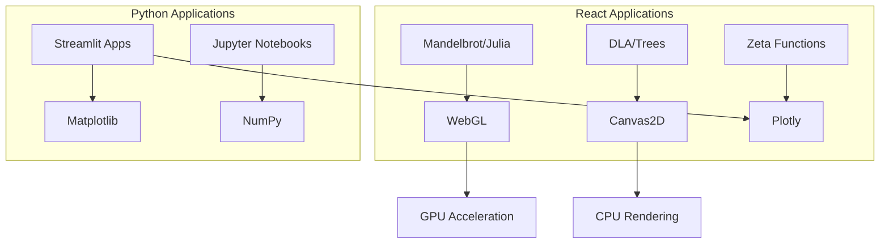

# Part VI: Interactive Applications

This section provides access to interactive tools and demonstrations for exploring fractal mathematics and self-affine patterns. The applications are implemented in two frameworks:

- **React Applications**: High-performance web applications with GPU-accelerated visualization
- **Streamlit Applications**: Python-based interactive tools for scientific exploration

## Available Tools

### Fractal Visualizations

| Application | Framework | Description |
|------------|-----------|-------------|
| [Mandelbrot Explorer](react-apps.md#mandelbrot-set) | React | Interactive Mandelbrot set visualization with zoom and parameter controls |
| [Julia Set Explorer](react-apps.md#julia-sets) | React | Real-time Julia set rendering with adjustable complex parameter |
| [DLA Simulator](react-apps.md#diffusion-limited-aggregation) | React | Diffusion Limited Aggregation growth simulation |
| [Barnsley Fern](react-apps.md#barnsley-fern) | React | IFS-based fern generation |

### Tree and Branching Architectures

| Application | Framework | Description |
|------------|-----------|-------------|
| [Pythagoras Tree](react-apps.md#pythagoras-tree) | React | Self-similar tree with adjustable branching angle |
| [L-System Trees](react-apps.md#l-system-trees) | React | Lindenmayer system-based tree generation |
| [3D Tree/Root Visualization](tree-roots-3d.md) | React | Three-dimensional branching network visualization |

### Analysis Tools

| Application | Framework | Description |
|------------|-----------|-------------|
| [Differential Box-Counting](dbc.md) | Python | Calculate fractal dimensions of grayscale images |
| [Noise Generators](react-apps.md#noise-generators) | React | 1/f noise and fractional Brownian motion |

### Mathematical Visualizations

| Application | Framework | Description |
|------------|-----------|-------------|
| [Riemann Zeta 2D](react-apps.md#riemann-zeta) | React | 2D visualization of the Riemann zeta function |
| [Riemann Zeta 3D](react-apps.md#riemann-zeta-3d) | React | 3D surface plot of zeta function magnitude |

## Quick Start

### Running React Applications

The React applications are deployed and accessible online:

[**Launch Interactive Apps**](https://tyson-swetnam.github.io/fractal-notebooks/react/){ .md-button .md-button--primary }

Or run locally:

```bash
cd react
npm ci
npm start
```

### Running Streamlit Applications

```bash
cd apps
pip install -r requirements.txt
streamlit run mandelbrot.py
```

## Technical Requirements

### For React Applications
- Modern web browser with WebGL support
- JavaScript enabled
- Recommended: Chrome, Firefox, or Safari

### For Python Applications
- Python 3.8+
- NumPy, SciPy, Matplotlib, Plotly
- Streamlit (for interactive apps)
- See [Installation Guide](installation.md) for full setup

## Application Architecture



## Contributing

To add new applications or improve existing ones:

1. **React apps**: Add new pages to `react/src/pages/`
2. **Streamlit apps**: Add new `.py` files to `apps/`
3. Follow the existing code patterns for consistency
4. Include documentation in this section
