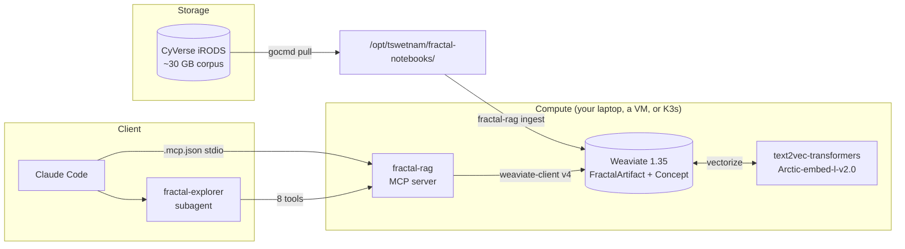

# Fractal RAG Stack

A self-hosted retrieval-augmented generation (RAG) stack that turns the
Fractal Notebooks research corpus — ~50K Constellate scholarly articles plus
this repository's Jupyter notebooks and MkDocs pages — into a vector index
you can query from Claude Code via a custom **`fractal-explorer`** subagent.

## Pick your path

| If you are… | Read |
|---|---|
| A developer who wants to try the stack on a laptop without GPUs | **[Local setup](local-setup.md)** |
| An operator deploying to a CyVerse / Jetstream-2 / on-prem GPU node | **[Hosted VM (K3s)](hosted-vm.md)** |
| A researcher who already has it running and just wants to use it | **[Using the fractal-explorer agent](using-the-agent.md)** |
| Hitting an error | **[Troubleshooting](troubleshooting.md)** |

## What's in the box

| Component | Source | Purpose |
|---|---|---|
| `fractal_rag/` Python package | this repo | parsing, chunking, concept enrichment, ingest, MCP server |
| `k3s-deployment/*.yaml` | this repo | Weaviate 1.35 + GPU embedding sidecar manifests |
| `docker/fractal-rag/docker-compose.yaml` | this repo | Single-node local stack (CPU-only) |
| `.claude/agents/fractal-explorer.md` | this repo | Custom retrieval subagent definition |
| `.mcp.json` | this repo | Repo-local MCP server wiring |
| Constellate JSONL corpus | iRODS `/iplant/home/tswetnam/fractal-notebooks/` | 50K scholarly articles |

## Worked examples

Three Jupyter notebooks under [`notebooks/`](notebooks/01_quickstart.ipynb)
exercise the index directly from Python — useful for prototyping queries
before you wire them into the subagent rubric:

1. [01 — Quickstart](notebooks/01_quickstart.ipynb) — connect, list concepts, run your first hybrid search.
2. [02 — Hybrid search patterns](notebooks/02_hybrid_search.ipynb) — `target_vector` tradeoffs, filters, `alpha` tuning.
3. [03 — Concept ontology](notebooks/03_concept_ontology.ipynb) — walking the `Concept` side-collection and following cross-refs.

## See also

- Design spec — `docs/superpowers/specs/2026-05-23-fractal-rag-agent-design.md`
- Verification checklist — `docs/superpowers/specs/2026-05-23-fractal-rag-agent-verification.md`
- Package source — [`fractal_rag/`](https://github.com/tyson-swetnam/fractal-notebooks/tree/main/fractal_rag)
