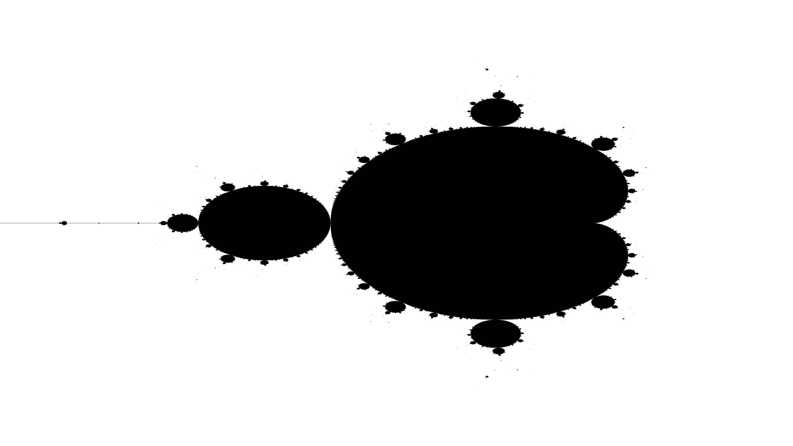

# Introduction

"Allometry" is the study of organismal size and physiological rates of change in relation to body parts (Huxley 1932, [1950](https://doi.org/10.1098/rspb.1950.0055){target=_blank}). The term "allometric" translates from Latin as "different measure," while "isometric" means "equal measure" (Huxley and Tessier [1936](https://www.nature.com/articles/137780b0){target=_blank}). Allometric scaling refers to the way that physiological or morphological traits, such as metabolism or limb size, change at different rates compared to overall size of an organism. Isometric scaling maintains the same ratio of lengths, making the object appear identical at different scales.

In 1975, Benoit Mandelbrot introduced the word 'fractal' to describe self-similar and irregular patterns found in nature (Mandelbrot [1977](https://riocuarto.gov.ar/files/documentos/1603551413_Literatura%20de%20Rio%20Cuarto%20entre%20Todos%20-%20A%C3%91O%202%20.%20N%C2%BA11.pdf){target=_blank}). In 1985 Mandelbrot published his book on self-affine fractals and fractal dimensions (Mandelbrot [1985](https://iopscience.iop.org/article/10.1088/0031-8949/32/4/001/pdf)). Mandelbrot later published on multifractals, 1/f noises, and Gaussian self-affinity in nature (Mandelbrot ([2002](https://www.google.com/books/edition/Gaussian_Self_Affinity_and_Fractals/CLLkvv9NhgEC?hl=en&gbpv=1&dq=Mandelbrot+self-affinity&pg=PA1&printsec=frontcover){target=_blank}, [2013](https://www.google.com/books/edition/Multifractals_and_1_%C6%92_Noise/oh7nBwAAQBAJ?hl=en&gbpv=1&dq=Mandelbrot+self-affinity&pg=PA206&printsec=frontcover){target=_blank}))

{ width="500" }

Plate 1: [Gaston Julia]([Wikipedia](https://en.wikipedia.org/wiki/Gaston_Julia)) created so-called [Julia sets](https://en.wikipedia.org/wiki/Julia_set) using interative functions over 100 years ago. [code](../apps/julia.py) written in Python.

{ width="500" }

Plate 2: The so-called [Mandelbrot Set](https://en.wikipedia.org/wiki/Mandelbrot_set), named in honor of Benoit Mandelbrot. [code](../apps/mandelbrot.py) written in Python. 

Mandelbrot was careful to point out that natural phenomena, including hierarchical branching networks in organisms, are "fractal-like" over a limited range, unlike true fractals, which repeat infinitely. In a review of the most widely cited research on fractals in biology, we found that vascular organisms and forests are almost exclusively referred to as being "self-similar," and, critically, they were measured using self-similar fractal dimension techniques ([Table 1](#table-1-reported-fractal-dimensions-and-techniques-measuring-fractal-behavior-in-plants-or-forests)).

For a phenomenon to be self-similar, it must have the same appearance at all scales. This is clearly not the case for organisms, as allometric theory describes changes in appearance as they grow and age (Huxley 1932, Kleiber 1932). This misuse of terminology appears to have started as an oversight by authors incorporating fractals into thir research and affecting how ecologists think about scaling processes in relation to fractal dimension.

In most cases, the misuse of "self-similar" has had limited impact on the field. For example, predictions from Metabolic Scaling Theory (MST) (West et al. 1999a, West et al. 1999b, Brown et al. 2002) remain unaffected since allometric equations are complementary to self-affinity. Acknowledging self-affinity may reconcile inconsistencies between MST and observed asymmetry in branching architectures (Bentley et al. 2013, Smith et al. 2014).

### Differentiating Between Self-Similarity and Self-Affinity

Reported fractal dimensions of trees and forests using self-similar dimensional analysis are likely to be incorrect based on these facts. Specifically, papers that report the length dimension [Hausdorff-Besicovitch] or box-counting dimension [Minkowski-Bouligand] of hierarchical branching phenomena (leaves, branches, forests) (Table 1) are more problematic.

Mandelbrot (1985) explained how evaluating fractals using self-similar techniques yields inaccurate results for measuring self-affine fractals because self-affine processes change their dimension between local and global scales. Since vascular plants have self-affine geometries, measuring them with self-similar fractal dimensions is likely to produce spurious values, as demonstrated in this study.

The basic fractal concept requires an object to exhibit a self-similar signal or shape, which can be measured as:

\[
N \propto \frac{1}{\varepsilon^{\beta}} \equiv \varepsilon^{-\beta}
\]

Equation 1

where \(N\) is the number of scalars \( \varepsilon \) required to measure the whole object, and \( \beta \) is a scaling exponent. Mandelbrot (1983, 1985) showed that all \( 1/f^{\beta} \) "noises" are self-affine, and \( \beta \) can be transformatively related to a fractal dimension \( \alpha \) via the Hurst exponent \( H \), such that \( \beta = 2\alpha - H \). Examples of \( 1/f^{\beta} \) noises include white noise (\( 1/f^0 \)) and Brownian noise (\( 1/f^2 \)).

A fractal object's topological dimension is given by \( \beta = \frac{\log N}{\log \frac{1}{\varepsilon}} \). A Euclidean object has a dimension \( \beta \) equal to an integer (Mandelbrot 1983). For example, if \( \beta = 2 \), the object is a square (\( \varepsilon^2 \)), or a disk where \( \varepsilon \) equals \( \pi \times \text{radius} \), and the object's mass \( m \) is equivalent to:

\[
m(\varepsilon) \propto \varepsilon^2
\]

When a portion of the object is removed, its new surface or mass is reduced by the factor \( \delta^{\beta} \), written as:

\[
m(\delta \varepsilon) = \delta^{\beta} m(\varepsilon)
\]

Equation 2

#### **Table 1:** Reported fractal dimensions and techniques measuring fractal behavior in plants or forests

| **Author(s) by Date** | **Self-similarity** | **Self-affinity** | **Allometric** | **Review (meta-analysis)** | **Characteristic Measured** | **Fractal Dimension(s)** | **DOI/URL** |
|-----------------------|---------------------|-------------------|----------------|----------------------------|----------------------------|--------------------------|-------------|
| **Mandelbrot 1982** | ✓ |  |  | ✓  | Multiple | Multiple | [DOI:10.7560/703544-005](https://doi.org/10.7560/703544-005){target=_blank} |
| **Sernetz et al. 1985**  | ✓ | | ✓ | ✓  | Multiple | Length | [DOI:10.1016/S0022-5193(85)80218-6](https://doi.org/10.1016/S0022-5193(85)80218-6){target=_blank} |
| **Morse et al. 1985** | ✓ | |  | | Canopy | Length | [DOI:10.1038/314731a0](https://doi.org/10.1038/314731a0){target=_blank} |
| **Mandelbrot 1986** | ✓ | ✓ | | | Multiple | Multiple | [DOI:10.1016/B978-0-444-86995-1.50004-4](https://doi.org/10.1016/B978-0-444-86995-1.50004-4){target=_blank}
| **Frontier 1987** | ✓ | | ✓ | ✓  | Multiple | Length | [DOI:10.1007/978-3-642-70880-0_9](https://doi.org/10.1007/978-3-642-70880-0_9){target=_blank} |
| **Tatsumi et al. 1989**  | | |  | | Roots  | Box Count | [URL](https://www.jstage.jst.go.jp/article/jsme1958/32/1/32_1_15/_pdf){target=_blank} |
| **Obert et al. 1990** | ✓ | |  | | Microbial Colony | Box Count Mass | [DOI:10.1007/BF00309226](https://doi.org/10.1007/BF00309226){target=_blank} |
| **Sugihara and May 1990** | ✓ | | ✓ | ✓  | Multiple | Multiple | [DOI:10.1126/science.2278542](https://doi.org/10.1126/science.2278542){target=_blank} |
| **Zeide 1991** | ✓ | |  | | Canopy | Length | [DOI:10.1093/forestry/64.4.375](https://doi.org/10.1093/forestry/64.4.375) |
| **Zeide and Gresham 1991** | ✓ | |  | | Canopy | Length | [DOI:10.1139/x91-172](https://doi.org/10.1139/x91-172) |
| **Zeide and Pfeifer 1991** | ✓ | |  | | Canopy | Length | [DOI:10.1139/x91-167](https://doi.org/10.1139/x91-167) |
| **Fitter and Strickland 1992**| | |  | | Roots  | Length | [DOI:10.1007/978-94-011-2151-0_4](https://doi.org/10.1007/978-94-011-2151-0_4) |
| **Milne 1992** | ✓ | ✓ |  | ✓  | Multiple | Length | [DOI:10.2307/1940036](https://doi.org/10.2307/1940036) |
| **Lorimer et al. 1994**  | ✓ | | ✓ | ✓  | Multiple | Length | [DOI:10.1139/x94-126](https://doi.org/10.1139/x94-126) |
| **Solé and Manrubia 1995** | ✓ | |  | | Canopy | Box Count | [DOI:10.1111/j.1461-0248.1995.tb00303.x](https://doi.org/10.1111/j.1461-0248.1995.tb00303.x) |
| **Tatsumi et al. 1995** | | | | | [DOI:10.1626/jcs.64.50](https://doi.org/10.1626/jcs.64.50)
| **Loehle and Li 1996** | ✓ | ✓ |  | | Information |  | [DOI:10.1016/S0303-2647(96)00021-0](https://doi.org/10.1016/S0303-2647(96)00021-0) |
| **Halley 1996**  | ✓ | |  | | 1/f noises  | Power Spectral | [DOI:10.1098/rspa.1996.0027](https://doi.org/10.1098/rspa.1996.0027) |
| **Plotnick et al. 1996** | | |  | | Canopy | Gliding Box (lacunarity) | [DOI:10.2307/2265712](https://doi.org/10.2307/2265712) |
| **Weishampel et al. 1998** | ✓ | |  | | Canopy | Lacunarity  | [DOI:10.1016/S0303-2647(97)00092-8](https://doi.org/10.1016/S0303-2647(97)00092-8) |
| **Zeide 1998** | ✓ | |  | | Canopy | Length | [DOI:10.1139/x98-139](https://doi.org/10.1139/x98-139) |
| **West 1999** | ✓ | | ✓ | | Branching | Box Count | [DOI:10.1126/science.284.5420.1677](https://doi.org/10.1126/science.284.5420.1677) |
| **West et al. 1999**  | ✓ | | ✓ | | Branching |  | [DOI:10.1126/science.276.5309.122](https://doi.org/10.1126/science.276.5309.122) |
| **Brown et al. 2000** | ✓ | | ✓ | ✓  | Multiple |  | [DOI:10.1073/pnas.97.11.6242](https://doi.org/10.1073/pnas.97.11.6242) |
| **Li 2000** | ✓ | ✓ |  | | Patch  | Information, Box Count | [DOI:10.1006/jtbi.2000.2070](https://doi.org/10.1006/jtbi.2000.2070) |
| **Enquist et al. 2002**  | ✓ | |  | | Canopy, Roots  |  | [DOI:10.1038/nature01269](https://doi.org/10.1038/nature01269) |
| **Halley et al. 2004** | | | ✓ | | |  | [DOI:10.1098/rspa.2004.1384](https://doi.org/10.1098/rspa.2004.1384) |
| **Drake and Weishampel 2000** | ✓ | |  | | Canopy | Multifractals | [DOI:10.1007/s004420050009](https://doi.org/10.1007/s004420050009) |
| **Eamus et al. 2002** | | |  | | Roots  | --  | [DOI:10.1071/FP02118](https://doi.org/10.1071/FP02118) |
| **Alados et al. 2003** | ✓ | |  | | Patch  | Information | [DOI:10.1016/S0304-3800(02)00268-1](https://doi.org/10.1016/S0304-3800(02)00268-1) |
| **Zhang et al. 2007** | | |  | | Canopy | Length | [DOI:10.1016/j.ecolmodel.2006.08.002](https://doi.org/10.1016/j.ecolmodel.2006.08.002) |
| **Enquist et al. 2010**  | ✓ | |  | | Canopy, Roots  | --  | [DOI:10.1098/rspb.2010.1080](https://doi.org/10.1098/rspb.2010.1080) |
| **West et al. 2010**  | | |  | | |  | [DOI:10.1038/s41586-019-0976-6](https://doi.org/10.1038/s41586-019-0976-6) |
| **Savage et al. 2010** | | |  | | |  | [DOI:10.1126/science.1071935](https://doi.org/10.1126/science.1071935) |
| **Seuront 2011** | ✓ | ✓ | ✓ | ✓  | Multiple |
---

